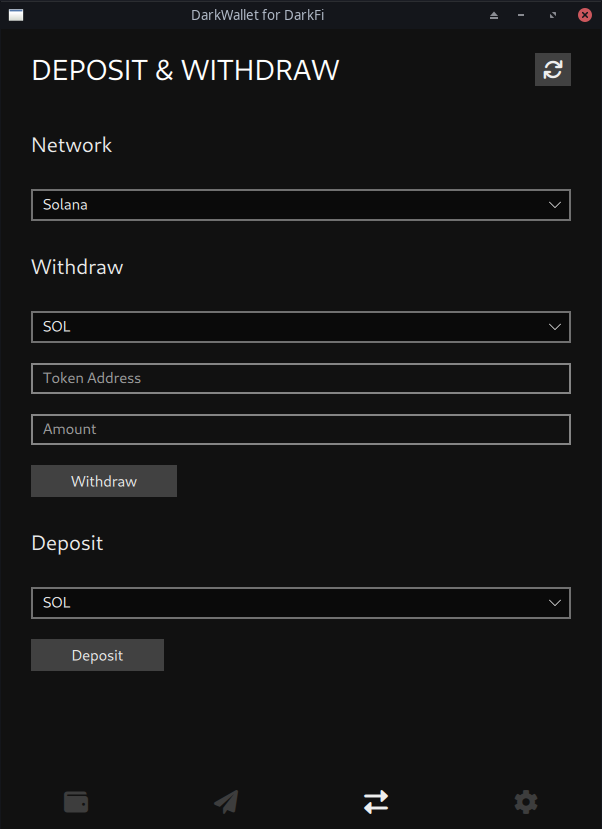

# DarkWallet For Darkfi

## Install

### install darkfid 

```
$ git clone https://github.com/darkrenaissance/darkfi
$ make
$ sudo make install
$ mkdir -p ~/.config/darkfi
$ cp -f /usr/local/share/doc/darkfi/*.toml ~/.config/darkfi
```

### install the wallet 

```
$ mkdir build && cd build 
$ cmake .. 
$ make 
$ ./darkwallet 
```




## Todos 

 	- [ ] Create & use libdarkfi-cpp  
	- [ ] Integrate DarkPulse  
	- [ ] Settings page  

